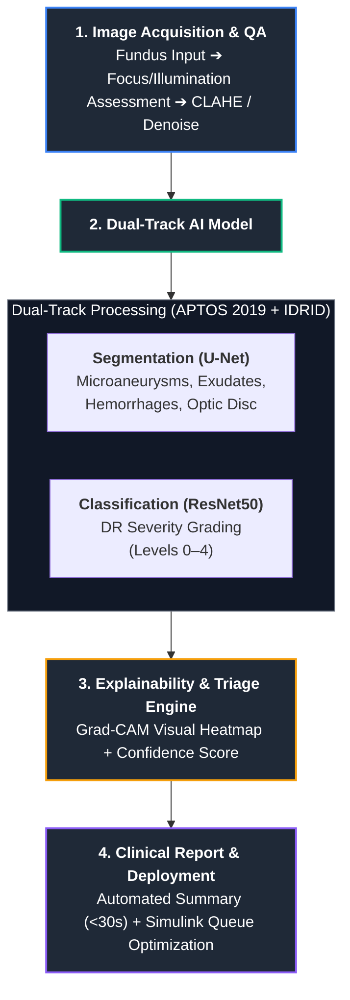

# RETINOVA 👁️ - Explainable AI for Diabetic Retinopathy Screening in Rural India

> **Team Name:** Retinova  
> **Team ID:** 174828  
> **Repository:** [GitHub Link](https://github.com/Akshaya282/RETINOVA.git)  

---

## 📌 Project Overview

**RETINOVA** is an integrated, explainable AI-driven healthcare pipeline designed for scalable Diabetic Retinopathy (DR) screening in low-resource settings and Primary Health Centres (PHCs) across rural India. 

By combining Deep Learning image classification and segmentation with system-level workflow simulation in MATLAB & Simulink, RETINOVA aims to bridge the rural healthcare gap, lower the screening burden on ophthalmologists, and facilitate early detection to prevent blindness.

---

## 🎯 Key Objectives

* **DR Severity Classification:** Automatically grade DR severity (Levels 0–4) from retinal fundus photography.
* **Explainable AI (XAI):** Generate Grad-CAM heatmaps and lesion segmentation maps (Microaneurysms, Hemorrhages, Exudates) to support transparent clinician validation.
* **Smart Telemedicine Triage:** Identify referable DR cases (Level 2+) for priority remote review by specialists.
* **System-Level Optimization:** Model and optimize patient queues, network bandwidth, and resource throughput using MATLAB-Simulink.

---

## ⚙️ Technical Architecture & Pipeline

### Integrated Workflow:
1. **Quality Assessment & Preprocessing:** Evaluates field of view, contrast, and focus. Enhances image clarity via CLAHE, Gaussian filtering, and denoising.
2. **Segmentation & Feature Extraction:** Pre-trained **U-Net** isolates lesions (Microaneurysms, Hard Exudates, Hemorrhages) and localizes the Optic Disc and Fovea.
3. **Classification & Grading:** Pre-trained **ResNet50** classifies fundus images into standard DR severity levels (0–4).
4. **Explainability Layer:** Integrates **Grad-CAM** attention mapping to produce visual evidence overlay for clinical validation.
5. **System Simulation:** **Simulink** models discrete-event screening queues, patient flow, and network bandwidth in PHCs.

---

## 📊 Performance Benchmark Targets

* **5-Class Classification Accuracy:** ~80.55%
* **Sensitivity:** >90% (90.72%)
* **Specificity:** >85% (91.64%)
* **Report Generation Time:** <30 seconds per scan

---

## 🛠️ Technology Stack & MathWorks Toolboxes

* **Core Platform:** MATLAB & Simulink
* **Toolboxes Used:**
  * Deep Learning Toolbox
  * Image Processing Toolbox
  * Computer Vision Toolbox
  * Medical Imaging Toolbox
  * Statistics and Machine Learning Toolbox
* **Datasets:** APTOS 2019 Blindness Detection, IDRID (Indian Diabetic Retinopathy Image Dataset)

---

## 🚀 Impact and Feasibility

* **Scalability:** Capable of facilitating 100K+ screenings annually, with an estimated capacity of ~274 screenings per day per center.
* **Workload Reduction:** Reduces ophthalmologist screening workload by **50–80%** by filtering out non-referable cases.
* **SDG Alignment:** Supports UN Sustainable Development Goals:
  * **SDG 3:** Good Health and Well-Being
  * **SDG 9:** Industry, Innovation, and Infrastructure
  * **SDG 10:** Reduced Inequalities

---

## 📚 Academic References

1. H. Shakibania et al., *"Dual branch deep learning network for detection and stage grading of diabetic Retinopathy,"* Biomedical Signal Processing and Control, 2024.
2. S. Akhtar et al., *"A deep learning based model for diabetic retinopathy grading,"* Scientific Reports, 2025.
3. W. L. Alyoubi et al., *"Diabetic retinopathy fundus image classification and lesions localization system using deep learning,"* Sensors, 2021.
4. U. Bhimavarapu et al., *"Automatic Microaneurysms Detection for Early Diagnosis of Diabetic Retinopathy Using Improved Discrete Particle Swarm Optimization,"* J. Pers. Med., 2022.
5. A. Bilal et al., *"AI-based automatic detection and classification of diabetic retinopathy using U-Net and deep learning,"* Symmetry, 2022.

---

## 🔗 Demos and References

* **GitHub Repository:** [RETINOVA Source Code](https://github.com/Akshaya282/RETINOVA.git)
* **Video Demo & Explanation:** [YouTube Channel](https://www.youtube.com/@JoshikaRA-h6p)
* **Drive Folder / Assets:** [Project Documents & Screenshots](https://drive.google.com/drive/folders/1KsEjUE7R6IKbDGQzFK31QYd0WifngVB8?usp=drive_link)
